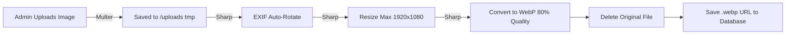
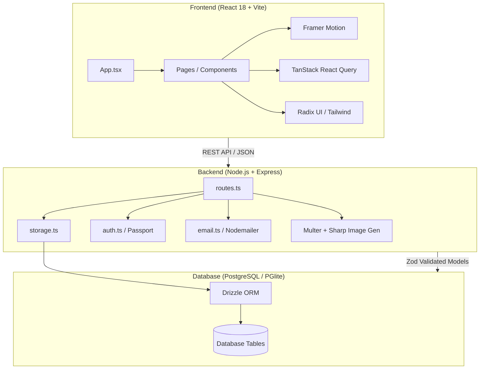

# Kora Hotel Suites — Complete System Walkthrough

> **Scope**: This document covers the entire full-stack architecture of the Kora Hotel Suites (Kora Apartment) project, including the public-facing website, the admin dashboard, the media processing pipeline, and the backend Express/Drizzle infrastructure.

---

## Table of Contents

1. [Client-Side Architecture & Routing](#1-client-side-architecture--routing)
2. [Database Setup & Data Layer](#2-database-setup--data-layer)
3. [Authentication & Session Management](#3-authentication--session-management)
4. [Backend API & File Upload Pipeline](#4-backend-api--file-upload-pipeline)
5. [Public Website Features](#5-public-website-features)
6. [Admin Dashboard (CMS)](#6-admin-dashboard-cms)
7. [Automated Email System](#7-automated-email-system)
8. [Deployment & Seeding](#8-deployment--seeding)
9. [Architecture Summary](#9-architecture-summary)

---

## 1. Client-Side Architecture & Routing

**File**: `client/src/App.tsx`

### How It Works

Kora Hotel Suites uses a modern React 18 single-page application (SPA) model powered by Vite, utilizing **Wouter** for lightweight routing and **Framer Motion** for premium animations.

```mermaid
flowchart TD
    A[App Loads] --> B[InitialLoader Animation]
    B --> C[QueryClient & AuthProvider Init]
    C --> D[Wouter Switch]
    D --> E[Public Routes (Home, Rooms, Contact)]
    D --> F[Admin Route]
    F --> G{Is Authenticated?}
    G -->|Yes| H[Admin Dashboard]
    G -->|No| I[Redirect to Auth Page]
```

**Key concepts:**
*   **Lazy Loading:** All pages are loaded via `React.lazy()` and wrapped in a `<Suspense>` boundary to ensure the initial JavaScript bundle remains small.
*   **Animated Transitions:** `AnimatePresence` and `motion.div` are used to create smooth fade-in/fade-out transitions between routes.
*   **Global Overlays:** The `InitialLoader` plays once per session, while `WhatsAppButton` and `CookieBanner` are rendered globally over all routes.

---

## 2. Database Setup & Data Layer

**File**: `shared/schema.ts`

### Drizzle ORM Schema

The system uses **Drizzle ORM** with Zod schema generation (`drizzle-zod`). This guarantees end-to-end type safety between the PostgreSQL database, the Express backend, and the React frontend.

| Table | Purpose |
|---|---|
| `rooms` | Core hotel suites data (price, capacity, amenities, main thumbnail, youtube URL) |
| `room_images` | Secondary image carousels specific to a single room |
| `gallery_images` | Standalone images for the main hotel photo gallery |
| `bookings` | Guest reservations (dates, guest counts, pending/confirmed status) |
| `contacts` | Guest inquiries from the frontend contact form |
| `site_settings` | Key-value store for global site config (brand info, SMTP, hero text, map location) |
| `users` | Admin credentials |

### Storage Abstraction

**File**: `server/storage.ts`
All database access goes through an `IStorage` interface, allowing the underlying database (Postgres or PGlite) to be swapped or mocked easily. Operations like `getRoomBySlug`, `createBooking`, and `upsertSettings` are defined here.

---

## 3. Authentication & Session Management

**File**: `server/auth.ts`

### Implementation

Admin authentication uses **Passport.js (Local Strategy)** backed by `express-session` and `memorystore` (or `connect-pg-simple` in production).

1. **Login:** Submitting to `/api/login` verifies the username and hashed password via `scrypt`.
2. **Session Persistence:** A secure session cookie is established.
3. **Route Protection:** The `isAuthenticated` middleware in `server/routes.ts` gate-checks API requests:
   ```typescript
   const isAuthenticated = (req, res, next) => {
     if (req.isAuthenticated()) return next();
     res.status(401).json({ message: "Unauthorized" });
   };
   ```

---

## 4. Backend API & File Upload Pipeline

**File**: `server/routes.ts`

### REST API

The Express server exposes a comprehensive REST API under `/api/*`:
*   **Public endpoints:** GET `/rooms`, `/gallery`, `/settings`, POST `/bookings`, `/contact`.
*   **Protected endpoints:** POST/PATCH/DELETE on rooms, images, settings, and booking statuses.
*   **Cache Prevention:** All API responses include aggressive `no-cache` headers to prevent stale admin dashboard data.

### Media Processing Pipeline

Kora Hotel Suites automatically optimizes uploaded images to guarantee fast loading speeds:



This prevents admins from uploading massive 10MB JPEGs that would slow down the frontend.

---

## 5. Public Website Features

**Files**: `client/src/pages/Home.tsx`, `RoomDetail.tsx`, `Gallery.tsx`

### Visual Aesthetics
*   **Premium Design:** Utilizes a custom Tailwind configuration (`tailwind.config.ts`) with specific brand colors, luxury typography, and glassmorphism effects.
*   **Media Support:** `RoomDetail.tsx` renders a flexible media layout. If a `youtubeUrl` is provided, it prioritizes a responsive iframe embed alongside the photo gallery.
*   **Dynamic Settings:** The `Home` page fetches hero text, hero background images, and "About" section details directly from the `site_settings` API, allowing the content to be fully CMS-driven.

---

## 6. Admin Dashboard (CMS)

**File**: `client/src/pages/admin-page.tsx`

### Interface Architecture

The Admin dashboard uses a sidebar layout (`react-resizable-panels`) and Radix UI Tabs to separate concerns:

| Tab | Functionality |
|---|---|
| **Bookings** | View reservations, approve/deny requests, update statuses. |
| **Rooms** | Full CRUD for suites. Assign names, prices, capacity, descriptions, and comma-separated amenities. |
| **Room Images** | Upload and sort additional carousel images for specific suites. |
| **Gallery** | Manage the global hotel photo gallery (add captions, adjust sort order). |
| **Inquiries** | Read messages sent via the contact form. |
| **Settings** | Edit dynamic site text, upload hero images, configure SMTP credentials, update map coordinates. |

---

## 7. Automated Email System

**File**: `server/email.ts`

### Notification Workflows

The system uses `Nodemailer` to dispatch automated emails asynchronously (so as not to block the HTTP response). SMTP credentials are read dynamically from `site_settings`.

*   **Booking Created:** 
    *   Sends a "Booking Received" confirmation email to the guest.
    *   Sends a "New Booking Alert" to the designated Admin email.
*   **Contact Inquiry:** 
    *   Sends the raw message and contact details to the Admin email.

---

## 8. Deployment & Seeding

**File**: `CPANEL_DEPLOYMENT.md` & `server/routes.ts`

### Auto-Seeding

On server startup (`registerRoutes`), the system checks if the database is empty. If so, it:
1. Injects **4 predefined luxury suites** (Junior, Senior, Penthouse, Deluxe) with Unsplash placeholders and rich descriptions.
2. Upserts default `site_settings` (Hero text, SMTP placeholders, Map coordinates).
3. Ensures new tables (like `gallery_images`) exist, allowing seamless updates on environments like PGlite where `drizzle-kit push` might not run in production.

### Deployment Flow

The project includes an npm `build` script that compiles both the Vite frontend into `dist/public` and the Express backend into `dist/`. It is optimized for traditional Node.js cPanel hosting, relying on a single `.zip` deployment artifact.

---

## 9. Architecture Summary



> **Summary**: Kora Hotel Suites is a tightly integrated monorepo leveraging shared Zod schemas to ensure type safety from the database straight through to the React UI, while employing advanced image optimization and session management to deliver a production-ready, highly performant hotel CMS.
